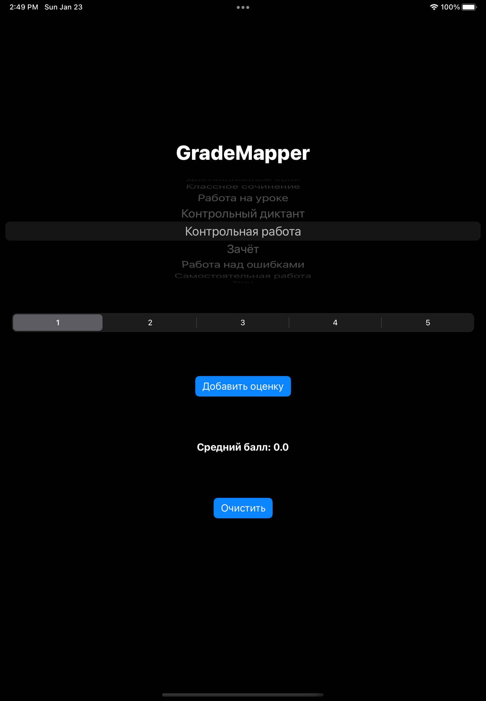

# GradeMapper
Программа для подсчёта среднего взвешенного оценок. Используется вес из Электронного журнала для [Электронного дневника СПб](dnevnik2.petersburgedu.ru).

Версия на [Python + PyQt](https://github.com/br-netw/GradeMapper)

## Screenshots

|  |  |
|-|-|
|  |  |
